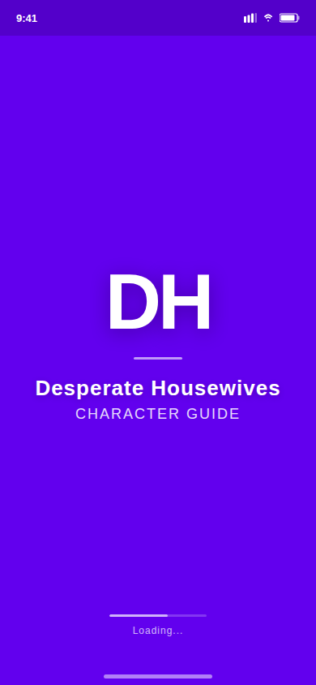
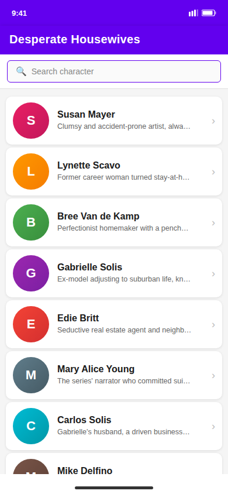
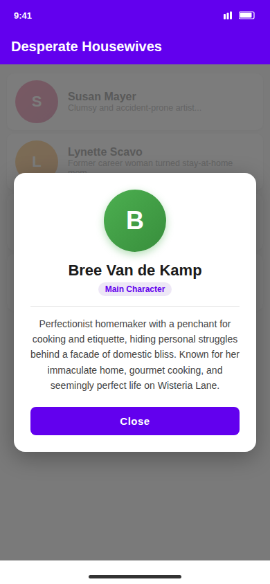

# Desperate Housewives Character Guide

[](https://opensource.org/licenses/MIT)

An Android app that provides an interactive character guide for the TV series *Desperate Housewives*. Browse and search all main characters with photos and detailed bios, with a polished splash/title screen on launch.

## Screenshots

| Splash Screen | Character List | Character Detail |
|---|---|---|
|  |  |  |

## Features

- **Splash / Title Screen** — "DH" branding displayed for 3 seconds before transitioning to the character list
- **Character List** — Scrollable RecyclerView showing all main characters with their photo, name, and short description
- **Remote Image Loading** — Character photos fetched from URLs via the Coil library with crossfade animation, placeholder, and error fallback
- **Live Search** — `OutlinedTextField` filters characters in real time by name or description (case-insensitive)
- **Character Detail Dialog** — Tap any character to open a modal card dialog showing the full name and description
- **Compose + View interop** — Jetpack Compose hosts the app shell and dialogs; a classic `RecyclerView` adapter handles the scrollable list

### Characters included

Susan Mayer, Lynette Scavo, Bree Van de Kamp, Gabrielle Solis, Edie Britt, Mary Alice Young, Carlos Solis, Mike Delfino, Tom Scavo, Paul Young

## Tech Stack

| Layer | Technology |
|---|---|
| Language | Kotlin |
| UI | Jetpack Compose (Material 3) + AndroidView interop |
| List rendering | RecyclerView + custom `CharacterAdapter` |
| Image loading | Coil (`io.coil-kt`) |
| Architecture | Single-Activity, composable-driven navigation |
| Build system | Gradle with Kotlin DSL + Version Catalog |
| Min SDK | 24 |
| Target / Compile SDK | 34 |
| AGP | 8.6.0 |
| Kotlin | 1.9.0 |

## Project Structure

```
DesperateHousewivesCharactersNew/
├── app/
│   └── src/main/
│       ├── java/com/example/desperatehousewivescharacters/
│       │   ├── MainActivity.kt          # Entry point; TitleScreen, CharacterList, CharacterAdapter
│       │   └── ui/theme/               # Material 3 theme (Color, Type, Theme)
│       ├── res/
│       │   ├── layout/item_character.xml  # RecyclerView item layout
│       │   └── values/                    # colors.xml, strings.xml, themes.xml
│       └── AndroidManifest.xml
├── gradle/
│   ├── libs.versions.toml              # Centralized version catalog
│   └── wrapper/
├── settings.gradle.kts
└── build.gradle.kts
```

## How to Build

### Prerequisites

- Android Studio Hedgehog (2023.1.1) or newer
- Android SDK with API level 34 platform installed
- JDK 17+

### Steps

1. Clone the repository and open the `DesperateHousewivesCharactersNew` folder in Android Studio.
2. Let Gradle sync complete — all dependencies download automatically.
3. Connect an Android device (API 24+) or create an AVD in the emulator.
4. Click **Run > Run 'app'** or press `Shift+F10`.

### Command-line build

```bash
./gradlew assembleDebug
```

Output APK: `app/build/outputs/apk/debug/app-debug.apk`

## Permissions

`android.permission.INTERNET` is declared in `AndroidManifest.xml` to allow loading character images from Wikipedia and other CDNs.

---

## 🇮🇱 תיעוד בעברית

### מה הפרויקט עושה

אפליקציית Android אינטראקטיבית המשמשת כמדריך דמויות לסדרת הטלוויזיה *Desperate Housewives*. האפליקציה פותחת עם מסך פתיחה (splash) של 3 שניות, ולאחר מכן מציגה רשימה גלילה של כל הדמויות הראשיות עם תמונותיהן ותיאורים קצרים. ניתן לחפש דמויות בזמן אמת ולפתוח דיאלוג מפורט בלחיצה על כל דמות.

**דמויות הכלולות באפליקציה:**
Susan Mayer, Lynette Scavo, Bree Van de Kamp, Gabrielle Solis, Edie Britt, Mary Alice Young, Carlos Solis, Mike Delfino, Tom Scavo, Paul Young

### טכנולוגיות

| שכבה | טכנולוגיה |
|---|---|
| שפת תכנות | Kotlin |
| ממשק משתמש | Jetpack Compose (Material 3) + AndroidView interop |
| רשימת דמויות | RecyclerView עם `CharacterAdapter` מותאם |
| טעינת תמונות | Coil (`io.coil-kt`) עם אנימציית crossfade ותמונת placeholder |
| ארכיטקטורה | Activity בודדת, ניווט מבוסס Composable |
| מערכת בנייה | Gradle עם Kotlin DSL + Version Catalog |
| גרסת SDK מינימלית | 24 (Android 7.0) |
| גרסת SDK יעד | 34 (Android 14) |
| הרשאות | `INTERNET` — לטעינת תמונות מ-Wikipedia ו-CDNs |

### הוראות התקנה והפעלה

**דרישות מקדימות:**
- Android Studio Hedgehog (2023.1.1) ומעלה
- Android SDK עם API רמה 34
- JDK 17 ומעלה

**שלבי הרצה ב-Android Studio:**
1. שכפל את הריפוזיטורי ופתח את תיקיית `DesperateHousewivesCharactersNew` ב-Android Studio.
2. המתן לסיום סנכרון Gradle — כל התלויות מורדות אוטומטית.
3. חבר מכשיר Android (API 24+) או צור AVD (אמולטור).
4. לחץ על **Run > Run 'app'** או הקש `Shift+F10`.

**בנייה משורת פקודה:**
```bash
./gradlew assembleDebug
```
קובץ ה-APK ייווצר בנתיב: `app/build/outputs/apk/debug/app-debug.apk`

### מבנה הפרויקט

```
DesperateHousewivesCharactersNew/
├── app/
│   └── src/main/
│       ├── java/com/example/desperatehousewivescharacters/
│       │   ├── MainActivity.kt          # נקודת כניסה; TitleScreen, CharacterList, CharacterAdapter
│       │   └── ui/theme/               # ערכת נושא Material 3 (צבעים, טיפוגרפיה)
│       ├── res/
│       │   ├── layout/item_character.xml  # פריסת פריט ברשימת RecyclerView
│       │   └── values/                    # colors.xml, strings.xml, themes.xml
│       └── AndroidManifest.xml
├── gradle/
│   ├── libs.versions.toml              # קטלוג גרסאות מרוכז
│   └── wrapper/
├── settings.gradle.kts
└── build.gradle.kts
```

**תיאור המסכים:**
- **מסך פתיחה (Splash)** — מציג את המיתוג "DH" למשך 3 שניות לפני המעבר לרשימה
- **רשימת דמויות** — רשימה גלילה עם תמונה, שם ותיאור קצר לכל דמות; תמיכה בחיפוש חי
- **דיאלוג דמות** — לחיצה על דמות פותחת כרטיס מפורט עם שם מלא ותיאור מורחב
